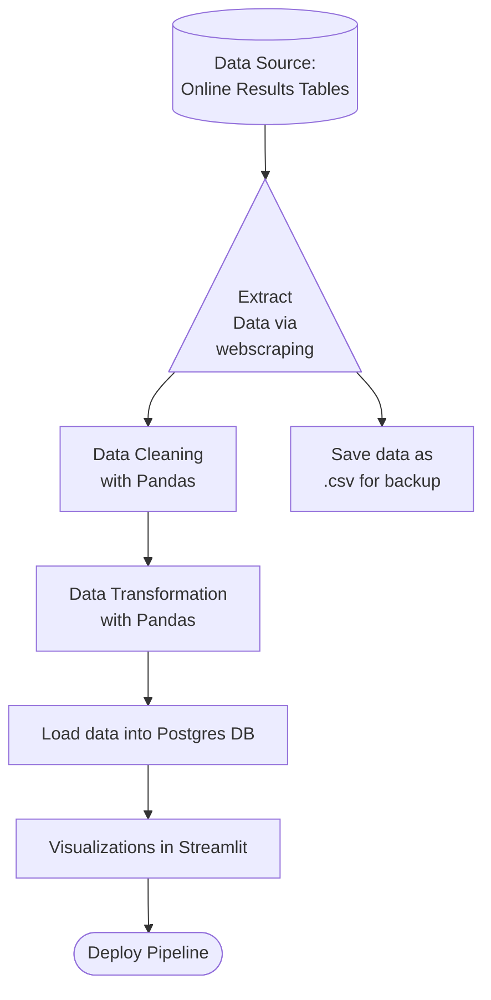

# Capstone Project Plan - Rupert Watson - ParkRunner

## Project Brief

One of my favourite things about living in the UK is [Parkrun](https://www.parkrun.org.uk/). Parkrun is a weekly 5km run that takes place every Saturday morning in over 800 locations across the UK. I love how it forms stronger local communities and is focused on inclusivity. 

On the [Parkrun website](https://www.parkrun.org.uk/), results from each Parkrun event are accessible individually and are updated weekly. But wouldn't it be great to be able to view results across various parkruns - We would then be able to find the fastest times from the given week, compare statistics about your local Parkrun compared to national averages, and make demographic analysis such as age distributions.

So, my goal is to make insights into Parkruns on a National level via a Streamlit Application. To do this, I will build an ETL pipeline that will extract the data from the Parkrun website, clean and transform the data in Pandas, store the data in a Postgres Pagilla database, and run queries on the data in order to make visualisations on Streamlit.

## Project Scope

- Each week, obtain only the most recent parkrun results for each location. Not focused on historical trends.
- Only obtain data for Parkrun events within the U.K. (not including Junior Parkruns)

## Data Flow Diagram

### Top Level Data Flow Diagram

## Project Backlog

- [X] Get a list of all Parkrun events within the UK
- [X] Scrape the results from all UK parkruns, storing the data in a list of dictionaries.
- [ ] Load the data into a Pandas Dataframe
- [ ] Clean the dataset
- [ ] Transform the dataset
- [ ] Load the data into Pagilla Database
- [ ] Build a Streamlit Application to make visualisations
- [ ] Deploy the pipeline, updating the dataset on a weekly basis

## Ethical Considerations Concerning Webscraping

I researched how I could obtain the Parkrun data. Unfortunately, there is no publicly available Parkrun API, so I opted to scrape the data from their website. To ensure ethical use of their data, I adhered to the following practices:

1. Ensure that requests are not made during peak times (Do not run the extraction on weekends, when the public will be checking recent results)
2. Add a wait time between requests to reduce server load.
3. Only extract publicly accessible data.
4. Do not use the data for personal monetary gain.
5. If I was to expand on and update this project further, I would contact the Parkrun administrators for guidance.

By following these considerations, I aimed to balance the project's objectives with respect for Parkrun's resources and intellectual property.
